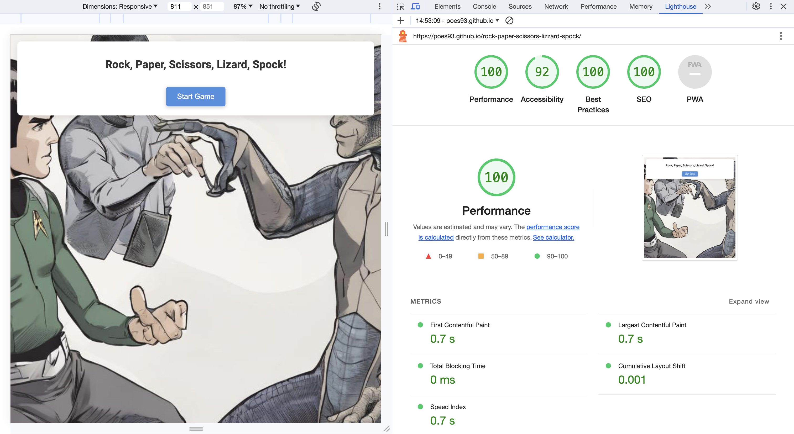

Welcome,

# Rock Paper Scissors Lizard Spock

This is my second project for Code Institute and i've been using HTML, CSS and JavaScript for the first time

[Here is a live demo of the website](https://poes93.github.io/rock-paper-scissors-lizzard-spock/)

---

## CONTENTS

* [User Experience](#user-experience-ux)
  * [User Stories](#user-stories)

* [Design](#design)
  * [Colour Scheme](#colour-scheme)
  * [Typography](#typography)
  * [Imagery](#imagery)
  * [Wireframes](#wireframes)

* [Features](#features)
  * [General Features on Each Page](#general-features-on-each-page)
  * [Future Implementations](#future-implementations)
  * [Accessibility](#accessibility)

* [Technologies Used](#technologies-used)
  * [Languages Used](#languages-used)
  * [Frameworks, Libraries & Programs Used](#frameworks-libraries--programs-used)

* [Deployment & Local Development](#deployment--local-development)
  * [Deployment](#deployment)
  * [Local Development](#local-development)
    * [How to Fork](#how-to-fork)
    * [How to Clone](#how-to-clone)

* [Testing](#testing)

* [Credits](#credits)
  * [Code Used](#code-used)
  * [Content](#content)
  * [Media](#media)
  * [Acknowledgments](#acknowledgments)

---

## User Experience (UX)

#### Why This Website Exists

I made this website to provide users with an engaging and accessible experience while playing the Rock, Paper, Scissors, Lizard, Spock game. It also offers visual customization through theme selection and ensures users have a clear understanding of the game rules.

#### User Stories 

User Stories

Starting the Game: User sees a start screen with title and button. Clicking "Start Game" opens game content.

Choosing a Move: User sees Rock, Paper, Scissors, Lizard, Spock images for selection. User needs to pick an one. Clicking an image shows win, loss, or draw outcome.

Viewing Score: Current score displayed. Option to reset score available.

Theme Selection: Option for dark mode provided.

Viewing Game Rules: Button to view game rules present. Option to return to game from rules.

Footer & Links: Footer shows copyright and creator's GitHub link.

Accessibility: Alt text for all images ensured. Clear labels for all interactive items.

## Design

### Colour Scheme

The main colors used in the website are:

* #ffffff: Used as the main color
* #4A90E2: Button color and header and footer color 
* #000000: Used text color 

### Typography

I've used googles font Roboto as the main font with San-Serif as backup

[Google Fonts](https://fonts.google.com/specimen/Roboto)

### Imagery

*The background image is generated by [Gencraft](https://gencraft.com/prompt/999ce25e-da30-492f-90a9-18156f812c09?index=0)

*The icons has been taken from this image [pngegg](https://www.pngegg.com/en/png-iiamd)

### Wireframes

## Features

Choose among Rock, Paper, Scissors, Lizard, and Spock and learn the rules

* In my footer there is a link to my Github to follow me

* Rules for the game 

* A reset game function

* A darkmode switch

* And its responsive to work on different screen sizes

### General features on each page

For a preview of the website on different screens
[amiresponsive](https://ui.dev/amiresponsive?url=https://poes93.github.io/rock-paper-scissors-lizzard-spock/)

### Future Implementations

  * Better displying when winning. The text should display in green (won) or red (lost) and also orange for draw. 
  * Have different difficulties

### Accessibility

* Icons with ARIA labels: To ensure that screen readers can understand the content 
* Contrast Requirements: The use of easy colors and easy to read and see elements
* Dyslexia/Accessible Friendly Fonts: The font used is easy to read

## Technologies Used

### Languages Used

This project uses only pure JavaScript, HTML, and CSS

### Frameworks, Libraries & Programs Used

Balsamiq - Used to create wireframe.

Github - To save and store the files for the website.

Google Fonts - To import the fonts used on the website.

Font Awesome - For the iconography on the website.

Google Dev Tools - To troubleshoot and test features, solve issues with responsiveness and styling.

Visual Studio Code - IDE

GitHub CoPilot - Helping me with the code 

Am I responsive? - To show the image on different devices

PngEgg - Button images

Gencraft - AI generated background image 

Google - To resolve issues and find ideas

w3 School - for getting new ideas and understanding

Youtube - for getting new ideas and understanding

## Deployment & Local Development

### Deployment

The site is deployed using GitHub Pages - rock-paper-scissors-lizzard-spock.

*To Deploy the site using GitHub Pages:

*Login (or signup) to Github.
*Go to the repository for this project, Poes93/rock-paper-scissors-lizzard-spock.
*Click the settings button.
*Select pages in the left hand navigation menu.
*From the source dropdown select main branch and press save.
*The site has now been deployed, please note that this process may take a few minutes before the site goes live.

### Local Development

#### How to Fork

To fork the repository:

*Log in (or sign up) to Github.
*Go to the repository for this project, Poes93/rock-paper-scissors-lizzard-spock
*Click the Fork button in the top right corner.

#### How to Clone

To clone the repository:

*Log in (or sign up) to GitHub.
*Go to the repository for this project, Poes93/rock-paper-scissors-lizzard-spock
*Click on the code button, select whether you would like to clone with HTTPS, SSH or GitHub CLI and copy the link shown.
*Open the terminal in your code editor and change the current working directory to the location you want to use for the cloned directory.
*Type 'git clone' into the terminal and then paste the link you copied in step 3. Press enter.

## Testing

* Website was tested on the following browsers and with a Macbook Pro 14" 2021: Chrome, Safari and Brave.
* For mobile it's been tested on a iPhone 13 Pro.
* The website is responsive when using Google Devtools responsive screen adjuster.
* HTML Validator, CSS Validator and Wave for accessiblity 

| Purpose                                              | Action                  | Expected                                            | Result |
| ---------------------------------------------------- | ----------------------- | --------------------------------------------------- | ------ |
| Start Button gets to the game                        | Click Start Game button | Come to game section                                | PASS   |
| Choose Rock                                          | Click Rock img          | Getting a win, lose or draw result                  | PASS   |
| Choose Paper                                         | Click Paper img         | Getting a win, lose or draw result                  | PASS   |
| Choose Scissor                                       | Click Scissor img       | Getting a win, lose or draw result                  | PASS   |
| Choose Lizard                                        | Click Lizard img        | Getting a win, lose or draw result                  | PASS   |
| Choose Spock                                         | Click Spock img         | Getting a win, lose or draw result                  | PASS   |
| Reset the game score                                 | Click Reset Score       | Current result sets to 0 for both computer and user | PASS   |
| I want to change to dark mode                        | Click Dark Mode         | Website to change its color scheme                  | PASS   |
| I want to change from dark mode                      | Click Dark Mode again   | Website to change its color scheme to standard      | PASS   |
| I want to see the rules                              | Click Show Rules        | Come to rules section                               | PASS   |
| I want to go back to the game while in rules section | Click Back to Game      | Come back to game section                           | PASS   |
| Github link in the footer should link to my profile  | Click Github icon       | Come to Github profile //Poes93                     | PASS   |

W3C Validator

### Bugs

These are the current bugs on the website. I can't seem to find out how to currently solve them. I think these issues is due to the Nav/header bar with the scaling of the elements.

* The footer is not the same size as the header 

## Credits

### Code Used

### Content

###  Media

###  Acknowledgments

Thank you Carolina Leguizamon for the help during and support and for the stress
Daisy McGirr for being a supportive mentor 

